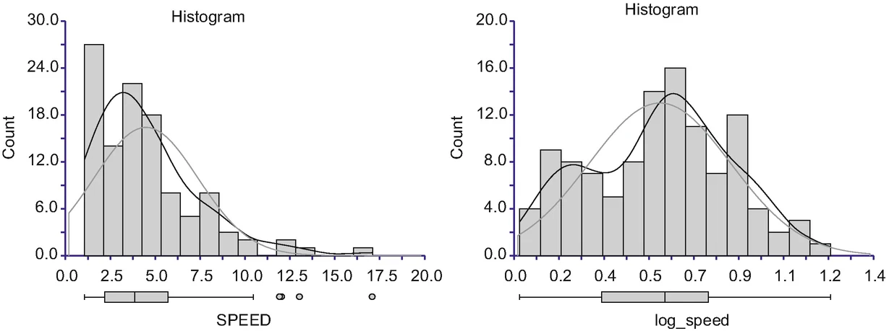
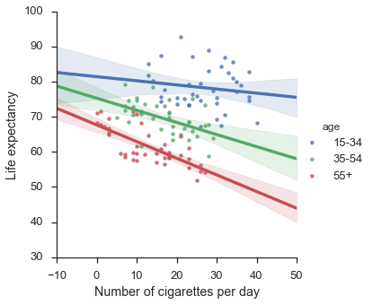
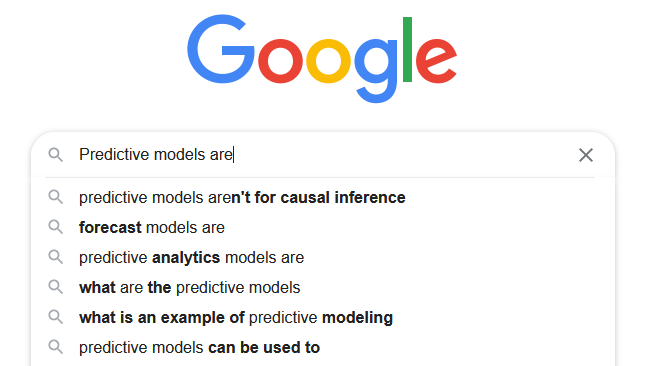
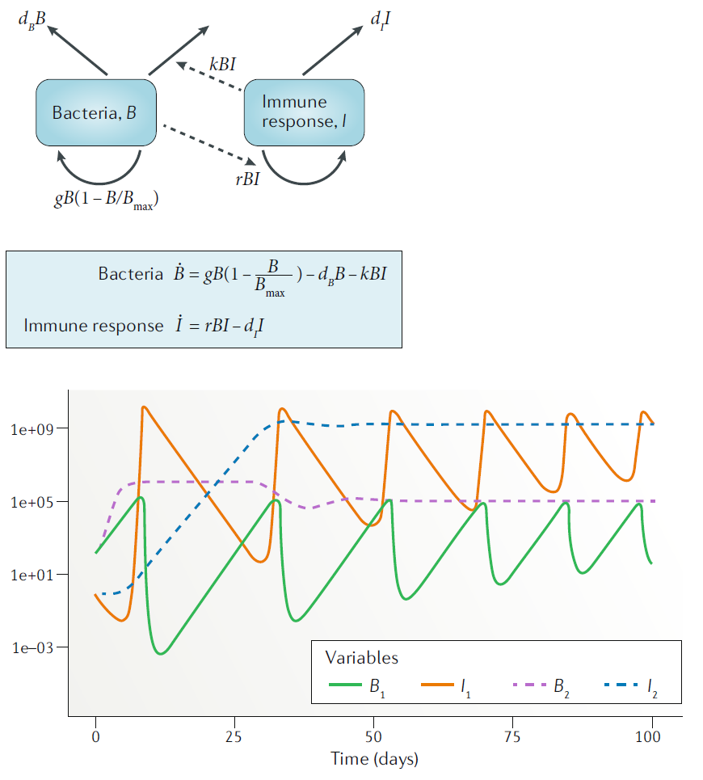
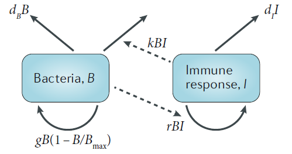

## Introduction

* This lecture is a very short introduction to within-host modeling.
* More information and details are in the previously recorded lectures and the readings on the SMI website.
* Use Slack for any questions/thoughts/feedback (better than Zoom chat since it will stay).


##  __Phenomenological/non-mechanistic/(statistical) models__

* Examples: t-test, linear/logistic regression model, deep neural network
* Always applied to data 
* Are sometimes causal
* Do not describe mechanisms underlying the system of study

```{r ,  echo=FALSE, fig.cap='Source: xkcd.com', out.width = '90%', fig.align='center'}
knitr::include_graphics("../media/xkcd-cancer-causes-cell_phones.png")
```


## Descriptive Analysis 

```{r ,  echo=FALSE, fig.cap='Source: Cooksey 2020 "Illustrating Statistical Procedures: Finding Meaning in Quantitative Data"', out.width = '90%', fig.align='center'}

```

## Inference

```{r ,  echo=FALSE, fig.cap='Not real data. See [here](http://ds.gregvi.al/2016/11/19/smoking-is-good/) for details.', out.width = '80%', fig.align='center'}

```


## Prediction

```{r ,  echo=FALSE, fig.cap='', out.width = '80%', fig.align='center'}

```
</div>


## __Mechanistic/simulation models__

<div style="float: left; width: 40%;">
* Are always causal
* Include mechanisms
* Usually have a time/dynamic component
* Can be used with or without data
</div>

<div style="float: right; width: 60%;">
```{r ,  echo=FALSE, fig.cap='Source: _Simulation modelling for immunologists_', out.width = '90%', fig.align='center'}

```
</div>


## Inference

<div style="float: left; width: 40%;">
$$
\begin{aligned}
\dot U &=  - b(1-e_1)UV\\ 
\dot I &= bUV - d_I I \\
\dot V &= p(1-e_2)I - d_V V\\
& - g b(1-e_1) UV 
\end{aligned}
$$
</div>

<div style="float: right; width: 60%;">
```{r ,  echo=FALSE, fig.cap='Source: _Simulation modelling for immunologists_', out.width = '90%', fig.align='center'}
knitr::include_graphics("../media/nri_review_fig4b.png")
```
</div>


## Prediction

* Also sometimes called forecasting

```{r ,  echo=FALSE, fig.cap='', out.width = '80%', fig.align='center'}

```


## Causal exploration


* Also called what-if explorations

```{r kirschnertb,  echo=FALSE, fig.cap='Exploring/predicting cytokine-based interventions for TB (Wigginton and Kirschner, 2001 J Imm)', out.width = '80%', fig.align='center'}
knitr::include_graphics("../media/tbkirschner.png")
```


## Our models 

* Compartmental models (tracking total numbers of different types/compartments)
* Ordinary differential (or difference) equations


$$
\begin{aligned}
\textrm{Bacteria} \qquad \dot{B} & = g B(1-\frac{B}{B_{max}}) - d_B B - kBI\\
\textrm{Immune Response} \qquad \dot{I} & = r BI - d_I I
\end{aligned}
$$

```{r bacteriadiagram,  fig.cap='',  echo=FALSE, out.width = "70%", fig.align='center'}

```


## Our topics

* We will explore/play with a few simple models.
* We will do some activities that do not involve writing code, we'll also at the end of the course look at and modify some code.
* We unfortunately can't cover fitting models to data, but see DSAIRM and ask questions.


## Discussion, Q&A

* Type in Slack or Zoom Chat or just unmute yourself and ask.


